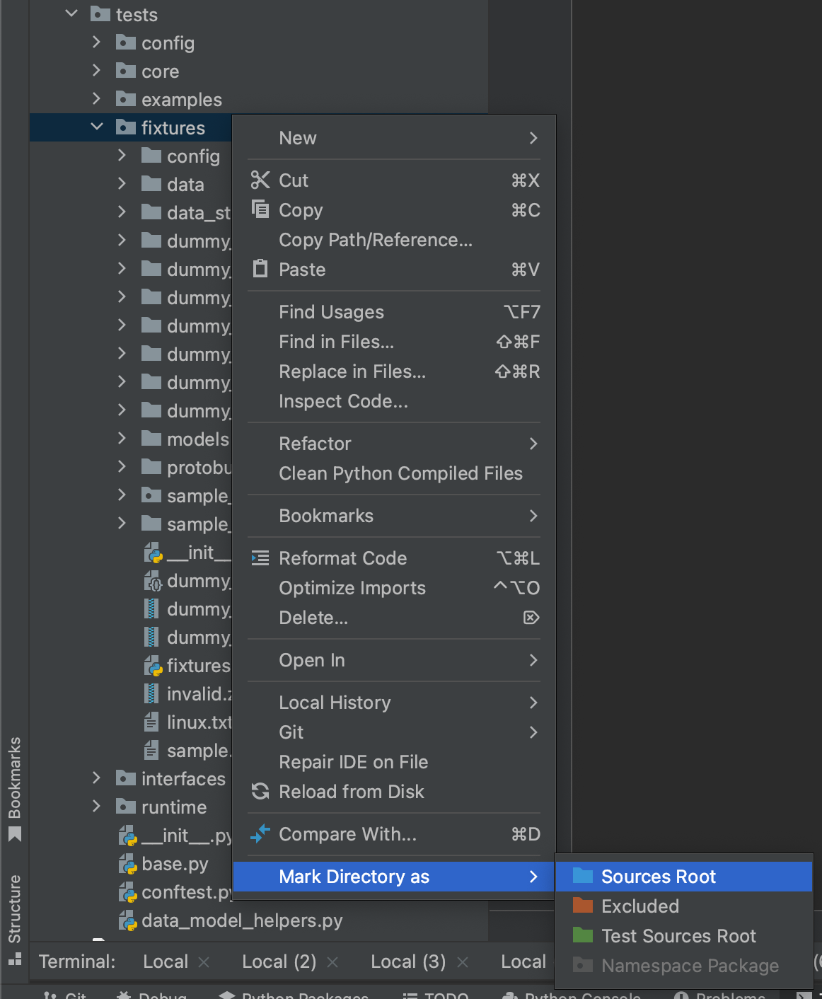

# Development Guide

{: .no_toc }

This document describes how to set up development environments to begin contributing to caikit projects.

- [Development Guide](#development-guide)
  - [Managing development environments with Tox](#managing-development-environments-with-tox)
    - [Installing tox](#installing-tox)
    - [Building and testing](#building-and-testing)
    - [Format and linting](#format-and-linting)
    - [Publishing a package](#publishing-a-package)
    - [Default Behavior](#default-behavior)
    - [Specifying project dependencies](#specifying-project-dependencies)
    - [How to define a new tox environment](#how-to-define-a-new-tox-environment)
  - [BYO Python Environment](#byo-python-environment)
  - [Setting up your IDE](#setting-up-your-ide)
    - [Setting up your IDE's python env](#setting-up-your-ides-python-env)
      - [1. Use your BYO env](#1-use-your-byo-env)
        - [PyCharm](#pycharm)
        - [VS-Code](#vs-code)
      - [2. Use a tox env](#2-use-a-tox-env)
      - [3. Let your IDE manage a fresh one](#3-let-your-ide-manage-a-fresh-one)
        - [PyCharm](#pycharm-1)
        - [VS-Code](#vs-code-1)
    - [Adding folders to Python path](#adding-folders-to-python-path)
      - [PyCharm](#pycharm-2)
      - [VS-Code](#vs-code-2)
    - [Running a debugger](#running-a-debugger)
      - [With PyCharm](#with-pycharm)
      - [With VS-Code](#with-vs-code)
        - [TL;DR](#tldr)
  - [Sample lib](#sample-lib)
    - [What is it](#what-is-it)
    - [How to play around with it](#how-to-play-around-with-it)

## Managing development environments with Tox

We use the virtual environment manager [tox](https://tox.wiki/en/4.10.0/) to run our builds.
We think of it as Make, but for python.
Plenty of public documentation is available for tox, but the quick gist is that for every task, tox manages an isolated virtual environment for that task and those environments all reside in the `.tox` directory.
These tasks and their environments are describe in the `tox.ini` file at the root of each repo.

### Installing tox

The `tox` tool must be installed on your system in order to run builds, since it is the entrypoint for all build commands.
Since `tox` is a python module, it may be installed in your favorite python virtual environment of choice and invoked from there.
Though it is important to note that the environment where you install tox will not be the environment where builds and tests are run.

You may also use a system package manager to install tox, e.g. on Mac you can run

```shell
brew install tox
```

### Building and testing

Running unit tests with tox should always be done against an installation of the library being built.
This is the default behavior of tox, but can be disabled with the `skip_install` configuration to test against source code directly.

To run unit tests, the `py` environment will use your system's default version of python, and run pytest.
Other specific python version can be supplied in the format `py39`, `py310`, `py311`.
A python interpreter must be installed and available on your system path in order for tox to pick it up to create the virtual environment.
Example usage:

```shell
tox -e py311
```

The `[testenv]` section in your `tox.ini` file is used to specify the behavior for these test runs.
It should always allow passthrough args to the `pytest` invocation so that developers can pass args in, like:

```shell
tox -e py311 -- tests/some/package/test_file.py
```

```shell
tox -e py311 -- -k some_test_prefix
```

### Format and linting

The `fmt` environment should apply all code formatting rules. This should include at least `black` and `isort`.
The `lint` environment should apply all static linting, e.g. with `pylint`

Projects should define pre-commit hooks so that developers can enable pre-commit checks for formatting and linting.
Otherwise, train your fingers to

```shell
tox -e fmt,lint
```

before committing.

### Publishing a package

The `publish` environment should be set up to publish the package to PyPi.
We generally use [Flit](https://flit.pypa.io/en/stable/index.html) for this, simply because it's easy.

To test publication, publish to the [pypi test instance](https://test.pypi.org/) by setting `FLIT_INDEX_URL` to `https://test.pypi.org/simple/`.

To publish a package for the first time, a token will need to be used that has user-scoped permissions in order to create the project on pypi.
This is a bit dangerous! We generally create a short-lived token for that and add it to the github repo only long enough to run the initial publish.
Once the pypi package is created, we replace the user-scoped token with one that has permissions scoped to that specific package.

### Default Behavior

By default, the `tox` command should run

- Unit tests
- Code formatting
- Linting

For example the top of your `tox.ini` should look similar to:

```ini
[tox]
envlist = py, lint, fmt
```

### Specifying project dependencies

All dependencies should be specified in extras sets in the `pyproject.toml` file.
This allows other python environments to be easily built without requiring the use of `tox`.

These extras sets are specified in the `[project.optional-dependencies]` section of the pyproject.toml file, and should include at least:

- `dev-test`: Everything required to run unit tests
- `dev-fmt`: Everything required to run formatting and linting
- `dev-docs`: Everything required to build and publish documentation
- `dev-build` Everything required to build and publish the package itself

### How to define a new tox environment

New environments can be set up by adding another

```ini
[testenv:{env_name}]
```

section to the tox.ini file.

They should all include at least a `description`, `extras`, and `commands` field.

For example:

```ini
[testenv:joe_cool]
description = A super fun environment that prints hello world
extras = dev-test
commands = python -c 'print("hello world")'
```

is invoked as:

```shell
$ tox -e joe_cool
joe_cool: commands[0]> python -c 'print("hello world")'
hello world
  joe_cool: OK (0.20=setup[0.17]+cmd[0.03] seconds)
  congratulations :) (0.27 seconds)
```

If environment variables are required, they must be specified in the `passenv` config.
If external scripts are invoked, they must be specified in the `allowlist_externals` config.

## BYO Python Environment

Tox is provided for convenience and consistency for CI actions, but you can easily set up your own virtual environment to develop with.

From the root of a caikit project:

1. Use your virtual environment manager of choice ([Conda](https://docs.conda.io/en/latest/), [raw venv](https://docs.python.org/3/library/venv.html), [virtualenv](https://virtualenv.pypa.io/en/latest/), etc.) to create and activate a fresh environment
2. `pip install .` to install the project and its core set of dependencies
3. Install any other extras with `pip install ".[${extra_name}]`. Check the `[project.optional-dependencies]` section of the `pyproject.toml` file for all available extras. This may look like `pip install ".[dev-test]"` or `pip install ".[all-dev]"` to install dependencies required to run tests and formatting.

## Setting up your IDE

Both Pycharm (Community Edition) and VS-code are very plug-and-play friendly and only needs minimal configuration.
It will need you to specify a python environment to use for indexing, code completion, and run/debug contexts.
It may also require some project-specific settings for your python path.

### Setting up your IDE's python env

By default, both VS-Code and PyCharm will try to use your system's python environment, and you probably don't want this.
Three other easy options are:

#### 1. Use your BYO env

##### PyCharm

If you've used an environment manager like `conda` to create a python environment already, you can point PyCharm to it.

From the Settings menu (`⌘ ,` on Mac), navigate to `Project: {project_name} > Python Interpreter > add interpreter > Add Local Interpreter`

Select `Environment: existing`
Navigate to the `python3` executable, for conda installed via homebrew this may look like
`/opt/homebrew/anaconda3/envs/${env_name}/bin/python3`

Save the new interpreter and Apply to the project

##### VS-Code

Open Command Pallete (⇧ ⌘ P), then type `Python: Select interpreter`, then navigate to the `python3` executable for your env.

#### 2. Use a tox env

This is not recommended by the tox maintainers, but you can re-use the existing `tox` environments for other purposes.

First create a tox environment, e.g. by running `tox -e py311`.
Follow the above steps for selecting an existing environment, and use `${repo_root}/.tox/py311/bin/python3`

#### 3. Let your IDE manage a fresh one

##### PyCharm

PyCharm can also create a new virtual environment for you.
From the `Add Local Interpreter` menu, select `Environment: new`.

You can choose where the environment is created, by default it will be placed in `${repo_root}/venv`.

##### VS-Code

VS-Code can also create a new virtual environment for you.

Open Command Pallete (⇧ ⌘ P), then type `Python: Create environment`, then select either `conda` or `venv`. You can also point it to your `requirements.txt` file if you have one to install all dependencies automatically.

### Adding folders to Python path

For some projects you may need to add directories to your PYTHONPATH to make packages importable.
For example, `caikit/caikit` has a `sample_lib` test fixture which contains a sample implementation of an AI library using caikit.
The top-level `conftest.py` will take care of adding that fixture to the syspath, but if you want PyCharm to have code-completion and indexing support, you'll need to configure it.

#### PyCharm

To do this in PyCharm, right-click the directory in the project explorer and select `Mark Directory As > Sources Root`



#### VS-Code

Create a `.env` file in the root directory, and add things to that:

```
PYTHONPATH=tests/fixtures
```

### Running a debugger

#### With PyCharm

If PyCharm's environment has been configured correctly, then debugging is pretty straightforward.
Breakpoints are set by clicking on the left editor sidebar next to the line numbers. Conditions can be added to breakpoints by right-clicking on them.

Debugging can be run by either:

1. Starting a debug session locally: Grab a unit test or `__main__` entrypoint and click the green run flag next to it
2. Attaching a debugger to a running process: Start a process (e.g. `$ python3 -m caikit.runtime`) and then select `Run > Attach to Process`

Remote debugging is available in PyCharm Professional. If you pay for that, you probably know how to use it!

#### With VS-Code

How to debug python modules is covered in this article: https://code.visualstudio.com/docs/python/debugging

##### TL;DR

1. Create a `.vscode` directory right next to `Caikit`'s home directory, and put this `launch.json` file within it:

   ```
   {
   "version": "0.0.1",
   "configurations": [
       {
       "name": "Python: Remote Attach",
       "type": "python",
       "request": "attach",
       "connect": { "host": "127.0.0.1", "port": 3000 },
       "justMyCode": false
       }
   ]
   }
   ```

   Note: `justMyCode` is a very cool feature that enables you to debug through external dependencies as well!

2. Once you do that, you need to install `debugpy` (Source code link: https://github.com/microsoft/debugpy):

   ```
   pip install debugpy
   ```

3. You need to start `Caikit` through debugpy in order to activate the debugger:

   ```
   python3 -m debugpy --listen localhost:3000 --wait-for-client -m caikit.runtime
   ```

   This should wait for the user to start the debug session through `vs-code` and it should stop on any breakpoints that you have configured.

## Sample lib

### What is it

https://github.com/caikit/caikit/tree/main/tests/fixtures/sample_lib

The `sample_lib` is a very simple non-production Caikit library that exists within the `tests/fixtures/sample_lib` directory, and consists of `Modules` and `Tasks` like a production `Caikit` library but with boilerplate code within those `Modules` . This library was created only for helping with unit testing.

If you are a new user of `Caikit` and you want to explore the gRPC or REST APIs without writing any code, then the `sample_lib` library can be a good place to start.

### How to play around with it

If you've followed the steps for setting up your IDE correctly, `sample_lib` should now already be on your `python_path`.

There's a useful README in `examples/sample_lib/README.md` that describes how to start the `Caikit` runtime with it. It automatically:

- adds `sample_lib` to your `python_path` (in case you don't have it)
- Dump all gRPC proto files and `openapi.json` for the HTTP server
- Create a `sample.json` file for training through gRPC
- Starts `Caikit runtime` with the right configurations.
